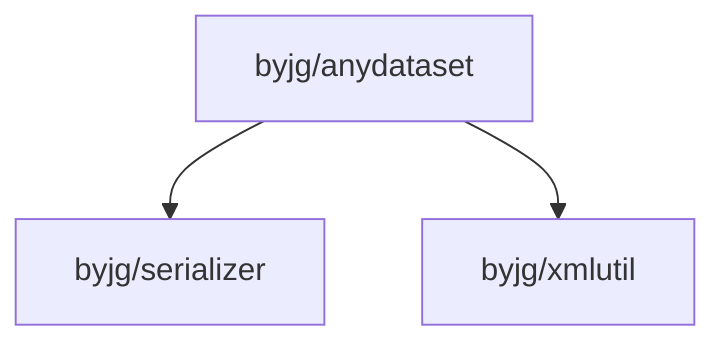

# AnyDataset

[](http://opensource.byjg.com)
[](https://github.com/byjg/php-anydataset/actions/workflows/phpunit.yml)
[](http://opensource.byjg.com)
[](https://github.com/byjg/php-anydataset/)
[](https://opensource.byjg.com/opensource/licensing.html)
[](https://github.com/byjg/php-anydataset/releases/)

AnyDataset is a data source abstraction layer for PHP. It provides a simple and consistent interface 
to access different data sources.

It is part of the [Anydataset project](https://packagist.org/providers/byjg/anydataset-implementation), 
an agnostic data source abstraction layer for PHP.

## Main Features

- Access different data sources using the same interface.
- Iterable results
- Convert results to array
- Format output
- Validate fields

## AnyDataset core

The AnyDataset core provides the minimum classes and interfaces to allow you to use the AnyDataset project and create 
your own implementation.

### How it works?

1. Create a database object
2. Get an iterator
3. Iterate over the results

```php
<?php
# Create a dataset
$dataset = new \ByJG\AnyDataset\Core\AnyDataset("example");

# Get an iterator
$iterator = $dataset->getIterator();
```

Iterating over the results:

**for...each**
```php
foreach ($iterator as $row) {
    print $row->toArray();
}
```

**while**
```php
// This one uses the PHP original implementation
while ($iterator->valid()) {
    $row = $iterator->current();
    print $row->toArray();
    $iterator->next();
}
```

**while (implementation 2)**
    
```php
while ($iterator->hasNext()) {
    // This returns the current row and move the pointer to the next
    print $iterator->moveNext()->toArray();
}
```

**toArray**
```php
print_r($iterator->toArray());
```

## Current Implementations

| Object                 | Data Source           | Read | Write | Reference                                           |
|------------------------|-----------------------|:----:|:-----:|-----------------------------------------------------|
| AnyDataSet             | Anydataset            | yes  |  yes  | [Github](https://github.com/byjg/anydataset)        |
| DbDriverInterface      | Relational DB         | yes  |  yes  | [Github](https://github.com/byjg/anydataset-db)     |
| ArrayDataSet           | Array                 | yes  |  no   | [Github](https://github.com/byjg/anydataset-array)  |
| TextFileDataSet        | Delimited Fields      | yes  |  no   | [Github](https://github.com/byjg/anydataset-text)   |
| FixedTextFileDataSet   | Fixed Size fields     | yes  |  no   | [Github](https://github.com/byjg/anydataset-text)   |
| XmlDataSet             | Xml                   | yes  |  no   | [Github](https://github.com/byjg/anydataset-xml)    |
| JSONDataSet            | Json                  | yes  |  no   | [Github](https://github.com/byjg/anydataset-json)   |
| SparQLDataSet          | SparQl Repositories   | yes  |  no   | [Github](https://github.com/byjg/anydataset-sparql) |
| NoSqlDocumentInterface | NoSql Document Based  | yes  |  yes  | [Github](https://github.com/byjg/anydataset-nosql)  |
| KeyValueInterface      | NoSql Key/Value Based | yes  |  yes  | [Github](https://github.com/byjg/anydataset-nosql)  |


### Filtering results

```php
<?php
$filter = new \ByJG\AnyDataset\Core\IteratorFilter();
$filter->addRelation("field1", \ByJG\AnyDataset\Core\Enum\Relation::EQUAL, 10);
$iterator2 = $dataset->getIterator($filter);
```

### Converting to Array

```php
<?php
$iterator = $dataset->getIterator();
print_r($iterator->toArray());
```

### Iterating with While

```php
<?php
$iterator = $dataset->getIterator();
while ($iterator->valid()) {
    $row = $iterator->current();

    print_r($row->get("field1"));
    $iterator->next();
}
```

or

```php
foreach ($iterator as $row) {
    print_r($row->get("field1"));
}
```

## Topics

- [The Row object](docs/row.md)
- [Filtering the results](docs/iteratorfilter.md)
- [Format the output](docs/rowoutput.md)
- [Validate the fields](docs/rowvalidator.md)
- [Populate the fields](docs/populate.md)

## Additional Classes


## Formatters

AnyDataset comes with an extensible set to format the AnyDataset. The interface is:

```php
namespace ByJG\AnyDataset\Core\Formatter;

interface FormatterInterface
{
    /**
     * Return the object in your original format, normally as object
     *
     * @return mixed
     */
    public function raw();

    /**
     * Return the object transformed to string.
     *
     * @return string
     */
    public function toText();

    /**
     * Save the contents to a file
     *
     * @param string $filename
     * @return void
     */
    public function saveToFile($filename);
}
```

AnyDataset implements two formatters:

- JsonFormatter
- XmlFormatter

Example:

```php
<?php
$formatter = new XmlFormatter($anydataset->getIterator());
$formatter->raw(); // Return a DOM object
$formatter->toText(); // Return the XML as a text
$formatter->saveToFile("/path/to/file.xml");  // Save the XML Text to a file.
```

## Install

```bash
composer require "byjg/anydataset"
```

## Running Unit tests

```bash
vendor/bin/phpunit
```

## Dependencies



----
[Open source ByJG](http://opensource.byjg.com)